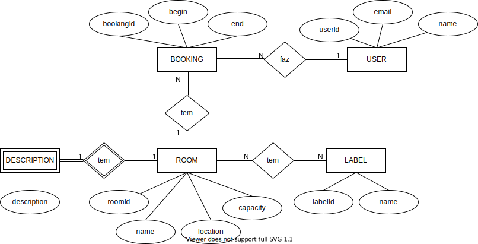

# Relatório Técnico do Projecto

## Introdução

Este documento contém os aspectos relevantes do desenho e implementação do projecto
de Laboratório de Software

## Modelação da base de dados

### Modelação conceptual ###

O seguinte diagrama apresenta a modelo entidade-associação para a informação gerida pelo sistema. 

Destacam-se os seguintes aspectos deste modelo:

- É necessária a existência de uma entidade fraca `DESCRIPTION` dado que as salas podem ou não ter 
descrição (*nullable*) e de modo a evitar a presença de valores *null* em `ROOM` optou-se pela criação
da nova entidade

O modelo conceptual apresenta ainda as seguintes restrições:

* ROOM:
    - o valor capacity não pode ser inferior a 1 
* BOOKING:
    - begin e end têm minutos múltiplos de 10
    - o tempo entre begin e end tem de ser superior a 10 minutos
    - o tempo de início deve ser superior ao atual

 
### Modelação física ###

O modelo físico da base de dados está presente em [ResetTables.sql](../src/main/resources/sql/ResetTables.sql) (apaga as tabelas para recriar se já estiverem lá) e [CreateTables.sql](../src/main/resources/sql/CreateTables.sql) (não faz nada se as tabelas já existirem).

## Organização do software

### Processamento de comandos

##### Interface com o utilizador (via Consola)

Para o processamento dos comandos via consola existe a partir da fase 3 a classe `ConsoleApplication`, que
junta as funcionalidades das classes `ConsoleApplication` e `AppProcessor` da fase 2, e que extende a classe
`Application`.

A classe `ConsoleApplication` tem como objetivo ficar a aguardar que o utilizado especifique comandos na janela
de consola, e quando existir um comando para ser processado então este será através do método `ConsoleApplication#processInput`.

##### Interface com o utilizador (via HTTP)

Na fase 3 foi implementada a interface com o utilizador através de **HTTP**. Esta nova interface permite
que possam ser lançadas instâncias de servidores **HTTP** pela consola através do comando `LISTEN`
(e.g. `LISTEN /`).

Para a criação de um servidor **HTTP** existe a classe `HttpApplication` que é responsável pela configuração
do novo servidor a ser criado, ou seja, é responsável por definir qual é o *servlet*, qual são as *routes* que
estão associadas a esse *servlet* e por iniciar o servidor, adicionando o mesmo à *pool* de servidores
gerida pela classe *HttpPool*. De modo a suportar a implementação do servidor **HTTP** foram usadas as 
bibliotecas *Jetty* e *JavaX Servlet*.

Para processar e responder aos pedidos feitos via **HTTP** foi usado um *servlet*, com implementação
em `AppServlet`. Este *servlet* tem como responsabilidade processar pedidos `GET`, `POST`, `PUT` e `DELETE`
através do `Router` da aplicação e responder a estes emitindo por defeito uma resposta em `TEXT/HTML`.

Para especificar a porta do servidor no comando `LISTEN` é possível através de duas diferentes formas
listadas abaixo por ordem de prioridade:

- Parâmetro do comando `LISTEN` (e.g. `LISTEN / port=8080`)
- Variável de ambiente `PORT`

Caso nenhuma porta seja especificada através destas duas formas então o comando recorre à porta padrão 8080.

Ainda existe a classe `HttpErrorHandler` que é usada durante a configuração do servidor para especificar
a resposta que deve ser apresentada ao utilizador na ocorrência de uma exceção durante o processamento
do pedido (`AppServlet`), sendo que a resposta apenas contém:

- O código de erro `HTTP` associado à exceção
- Uma mensagem breve
- Um *link* para a página inicial

De modo a existir um melhor controlo das instâncias **HTTP** criadas pela aplicação, foi ainda desenvolvido
o comando `CLOSE`, não especificado pelo enunciado do trabalho. Este comando tem como objetivo fechar uma
determinada instância de **HTTP** numa determinada porta, ou seja, a execução de `CLOSE / port=8080` na consola
fecha a instância que está associada à porta 8080 caso exista, caso contrário é enviada uma mensagem
de erro ao utilizador.

##### Handlers e Parâmetros de Request

Todos os *handlers* encontram-se no package `pt.isel.ls.handlers` sendo
que estes devem implementar a interface `RouteHandler`.
A interface `RouteHandler` contém um único método `execute` resposável
por executar o pedido e responder através de um `HandlerResponse`.

Cada *handler* devolve um `HandlerResponse` que, nesta fase do trabalho,
contém um `View`.

Os parâmetros dos comandos são passados através da classe `RouteRequest`
que para além da informação sobre o request, como o `Path`, contém métodos
para obter parâmetros de *path* (e.g `/user/{uid}`, onde `uid` é o parâmetro) 
e parâmetros do *request* em sí (e.g `?name=Jose`).

Enquanto os parâmetros do *path* são processados durante o processo
de *routing*, os parâmetros do *request* são processados pela classe
`RouteRequest` na chamada do método `of`, que tem como objetivo criar
um novo `RouteRequest` através de uma `String` de *request* (e.g 
`POST /users ?name=a&email=a@b.c`).

Para processar os parâmetros do *request* é usado o método `RouteRequest.parseParameters`
que recebe a secção de parâmetros da `String` de *request*. Este método começa
por separar todos os parâmetros em secções *key-value* (secções separadas
por `&`), percorrendo de seguida
cada uma destas secções e adicionado a um `HashMap` a chave e o valor correspondente
a cada sub-secção *key-value* (que estão separados por `=`). O `HashMap` é posteriormente devolvido ao método
que chamou `parseParameters`. Caso ocorra alguma exceção durante este processamento
será lançada uma exceção `RouteException`.

##### Resolução de Headers

A resolução dos *headers* de um determinado *request* é feita de forma semelhante à resolução dos parâmetros
de um *request*. Contudo ambos os *headers* e os parâmetros são opcionais, pelo que se o utilizador passar um destes é
necessário averiguar se se tratam de *headers* ou parâmetros. Para isto a resolução é feita primeiro assumindo
que foram passados parâmetros e caso seja lançada uma exceção nesta resolução então assume-se que foram passados *headers*.

Os *headers* de cada *request* são guardados na classe associada `RouteRequest`, pelo que todos os troços de
execução com acesso a uma instância de `RouteRequest` poderão obter um determinado *header*. Os *headers* disponíveis
estão ainda especificados na classe `HeaderType`, sendo que se o utilizador não passar um *header* válido
uma exceção será lançada.

### Encaminhamento dos comandos

Para o `Router` poder encaminhar os comandos estes devem ser registados no ínicio
da aplicação através do método `registerRoute`. Este método recebe como
parâmetros: o Método do *Request*, o *Template* da `Route` e o *Handler* que contém
a lógica necessária aquando da chamada desta *route*.

Caso o `Router` encontre a *route* então o *handler* desta é retornado, caso
contrário um *handler* padrão (*handler* de 404) é passado ao *caller*.

##### Método do Request

- `EXIT` que termina a aplicação
- `GET` que tem como objectivo ir procurar dados à fonte de dados
- `POST` que tem como objectivo inserir novos dados na fonte de dados da aplicação
- `OPTION` que lista as *routes* disponíveis e a sua descrição
- `PUT` que altera um recurso
- `DELETE` que elimina um determinado recurso
- `LISTEN` que inicia um novo servidor **HTTP** numa determinada porta
- `CLOSE` que fecha um servidor **HTTP** associado a uma porta

##### Template da Route

Para representar um *template*, isto é, uma representação das regras que o *path*
deve seguir, existe uma classe `RouteTemplate`.

Esta classe é responsável por transformar uma `String` num novo *template* (método `of`) e
por avaliar se um determinado `Path` observa este *template* (método `match`).

Para transformar uma `String` num novo *template* é necessário primeiramente
dividir a *string* em vários segmentos (secções do `Path` delimitadas por `/`).
Com todos os segmentos é decidido se o segmento é constante `ConstantTemplateSegment` (o nome do segmento
deve corresponder sempre, e.g `users`) ou se este é variável `VariableTemplateSegment` (o nome do segmento pode variar
consoante o pedido, e.g `{uid}`). Foi removida a opção de poder conter segmentos variáveis opcionais pois tal
aumentava a complexidade do código presente nos *handlers*.

A lista com todos os `TemplateSegment` é então passada ao constructor de `RouteTemplate`
e uma nova instância desta classe é devolvida ao *caller* de `of`.

No método `match` foi decidido realizar duas coisas ao mesmo tempo, de forma
a optimizar a performance do programa reduzindo as iterações:

- Verificar se o `Path` especifiado observa o *template*
- Obter os parâmetros variáveis com valores em `Path` e chaves presentes
no `TemplateSegment`.

Para analizar um possível `match` são percorridos todos os segmentos do *path*
ao mesmo tempo que são percorridos os segmentos do *template*, avaliando
um-a-um. Caso haja segmentos a menos (excepto opcionais), ou segmentos a mais, no `Path` então
o `match` retorna vazio. Caso contrário e um `match` ocorra, um mapa com os parâmetros de
`Path` é retornado.

É de notar que **todos os valores dos parâmetros** são encapsulados através da classe
`Parameter` que tem métodos para transformar estes valores (em `String`) noutros
tipos (`int` e `long`, por exemplo).

### Gestão de ligações

Para a gestão das ligações existe a classe `ConnectionProvider` que recebe no seu constructor a fonte de
dados. Todo o processamento transacional é tratado através do método `execute` desta classe que recebe
como parâmetro o bloco transacional a ser processado na forma da interface funcional `Provider`.

Para além do processamento transacional, a classe `ConnectionProvider` gere também o tempo de vida de
cada conexão à base de dados, sendo que este deve ser o mesmo que o tempo de vida de cada transação.

De modo a realizar *queries* à base de dados é necessário passar uma instância de `SqlHandler` às classes
de *queries*. Esta instância é passada através da interface `Provider` como argumento da função `apply`, e
pode ser usada por todos os *handlers* na forma de expressão lambda.

### Acesso a dados

Para realizar o acesso a dados (obter e inserir informação na fonte de dados) existem classes de
*queries* no package `pt.isel.ls.sql.queries`. Cada classe de *queries* representa uma parte do modelo
de dados, isto é, para cada relação da base de dados deve existir uma classe de *queries* que
operará sob esta relação.

Todas as classes de *queries* deve extender a classe abstrata `DatabaseQueries`. Esta classe abstrata
obriga a que cada momento de criação de uma nova classe deste tipo tenha de receber pelo constructor
uma instância de `SqlHandler` (que será obtida através do uso do `ConnectionProvider` nos *handlers*).

#### API fluente SQL

Para melhorar as *queries* à Base de Dados foi criada uma classe de alto nível que gere os `PreparedStatement`
e os `ResultSet` da *query*, `SqlHandler`. Esta nova *api* permite executar pesquisas na base de dados
facilmente através dos métodos disponíveis.

Para diferentes categorias de *queries* existem classes distintas (`Update`, `Search`), sendo que é possível ao
método que está a realizar a interrogação obter instâncias destas classes através dos métodos presentes
em `SqlHandler`.

Em todas as classes de tipo existem métodos para fazer *bind* de parâmetros ao `PreparedStatement`, para isto
é apenas necessário o programador passar o parâmetro como argumento da função `bind` (presente em `SqlType`)
e esta função tratará de associar o parâmetro ao *statement* que está a ser gerido pela instância.

Adicionalmente a classe `Search` da *api* permite realizar `map` de um `ResultSet` para instâncias de classes do
modelo, por exemplo, dado um `ResultSet` que incluí uma lista de utilizadores é possível mapear este resultado
para `Stream<User>` através da chamada à função terminal `mapToClass(User.class)`.

(Inspirado em [JDBI Fluent API](http://jdbi.org/#_fluent_api))

### Processamento de erros

Todos os erros são tratados como exceções, ou seja, uma exceção representa um erro. Para este efeito
existem exceções dedicadas para diversas categorias de erro ocorrentes durante a aplicação, tais como:

- `AppException` - quando existe um erro da aplicação
- `RouteException : AppException` - que pode ocorrer durante o processamento de uma `Route`/`Handler`

Existem ainda mais exceções que determinam erros específicos, contudo, as classes apresentadas
constituem a principal representação de erros no decorrer da aplicação.

No caso da ocorrência de um erro via consola então o erro ocorrido é apresentado nesta, sendo que a classe
responsável por apresentar a `View` da exceção é `ConsoleApplication`.

No caso em que o erro ocorreu sob um pedido `HTTP`, a classe responsável por atender este é `HttpErrorHandler`.

### Domain Specific Language (DSL)

Para a criação da **DSL** de **HTML** foi criado um *package* `pt.isel.ls.model.dsl`. Dentro deste package
encontram-se todas as classes relacionadas com esta **DSL**.

A **DSL** encontra-se dividida da seguinte forma:
- `Node` que representa um nó da árvore
    - `Element : Node` que representa um elemento **HTML**
        - `Node...` cada elemento pode conter vários nós filhos
    - `TextNode : Node` que representa um nó com texto

A cada nó é possível pedir uma representação textual de elementos, ou pedir ao nó em sí para escrever
num qualquer `Writer`.

Adicionalmente, é ainda possível adicionar atributos a um determinado nó através do método `addAttribute`
que recebe como parâmetro a chave e o valor do atributo a ser adicionado.

Para utilizar a **DSL** existe uma classe auxiliar `Dsl`, que permite ao utilizador desta especificar a árvore
de uma forma semelhante ao que faria se especificasse esta árvore num ficheiro **HTML**.

### Views

Na aplicação existem diversas *views* que representam diferentes respostas ao utilizador. Estas `Views`
representam, até à fase 3, apresentações textuais e no formato **HTML**. Cada `View` recebe através
de parâmetros do constructor os dados necessários a apresentar na mesma.

Para apresentar os dados podem ser usadas as classes `HtmlTableBuilder`, no caso de pretender uma tabela
em **HTML**, ou a classe `StringDetailBuilder` se o objetivo for apresentar uma lista de detalhes em formato
textual, por exemplo. Estas classes utilitárias estão presentes em `pt.isel.ls.view.utils` e implementam
uma *api* fluente de utilização fácil para o programador das *views*.

Para que aplicação possa mostrar uma determinada `View` ao utilizador é necessário existir um `ViewHandler`.
Este `ViewHandler` é responsável por implementar uma camada de abstração entre a aplicação e a visualização,
passando a informação necessária.

## Avaliação crítica

Na fase 1 do projecto *bookings* que fossem criados no mesmo horário e na mesma sala eram considerados
como válidos, contudo este problema foi resolvido na fase 2 pelo que isto não é mais possível.

Na fase 2 foram ainda modificados os `RouteHandler`, sendo que são estes os responsáveis por fornecer
informação sobre a `Route` ao `Router` (e.g *path*, *method*, *description*, ...).

Na fase 3 foram feitas melhorias significativas no código, principalmente no código de interrogações
à base de dados e nas *views*. Simplificou-se a utilização de exceções na aplicação, dado que `AppException`
passa a ser uma `RuntimeException`, não sendo obrigatória a criação de blocos de `try-catch` em expressões
*lamba*, por exemplo.

Os objetivos para a próxima fase são:

- Optimizar o código e realizar análises de complexidade em partes críticas.
    - Nomeadamente, optimizar `StringTableBuilder`
- Incluir imagens demonstrativas no relatório.